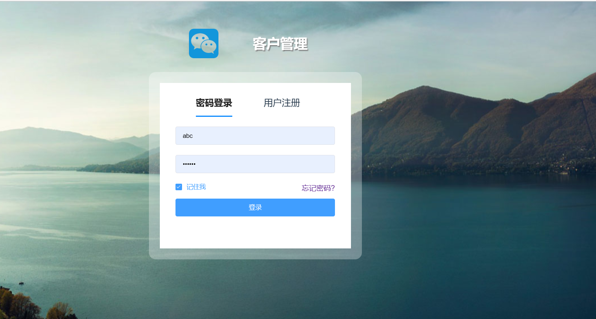
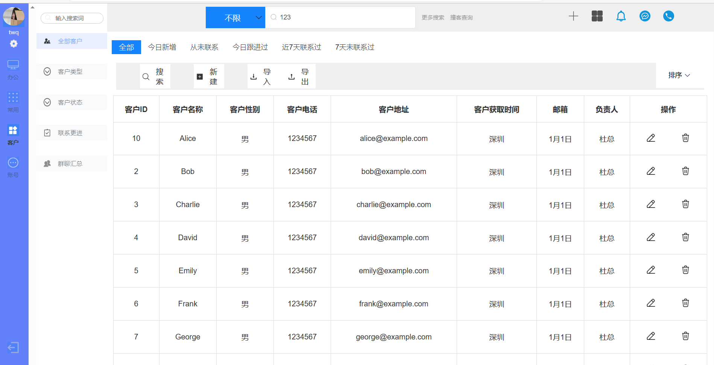
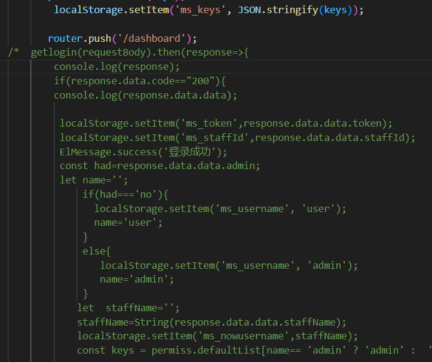
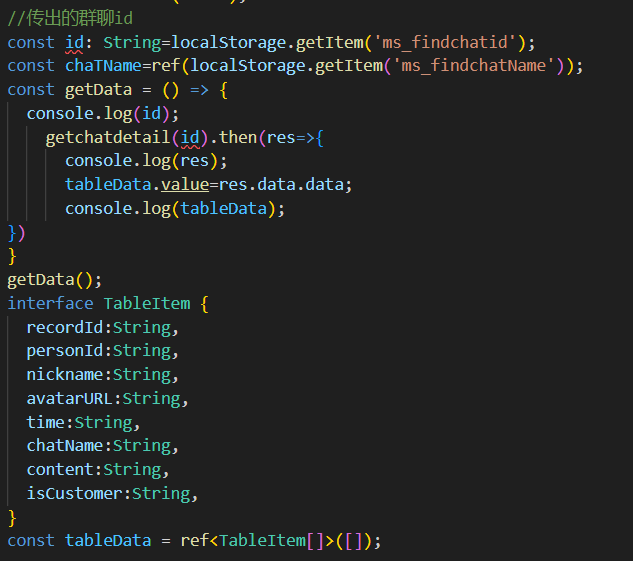

##### 此项目有两份不同的代码，因为后期发现使用vue3使用store好很多就进行了转换，并且使用了他人的框架。
***
# fristApp
使用vue2，并且使用了element-ui的组件

## 项目截图
### 登陆

### 页面

***
# vue-wechat-manage-system

基于 vue-manage-system框架的后台管理系统解决方案。[线上地址](https://github.com/lin-xin/vue-manage-system)

## 项目截图
因为已经连接好后端，但是当时并没有截图，所以仅展示部分代码。

### 连接后端登陆代码

### 获取数据

